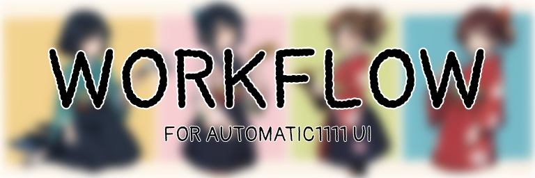
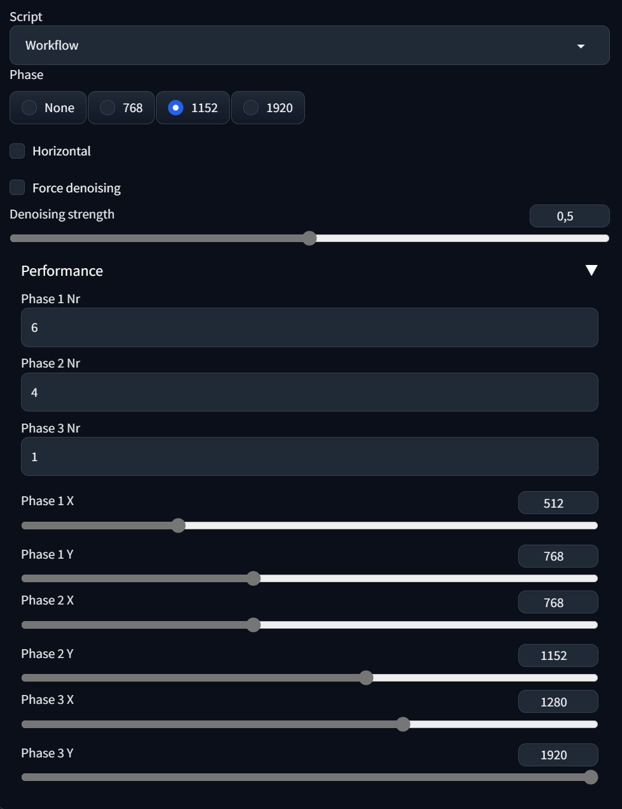

# Workflow

## Installation
Just copy the script from the scripts folder above into the extensions folder of your 1111automatic installation. Then restart 1111automatic, by clicking the "Reload UI" button on the bottom of the page.
To run the extension just scroll down in the img2img panel to the script selection and select Workflow.

## Features
*You'll probably need to read this to understand my workflow:* https://medium.com/p/6be78130eb9e

I've created this extension to help me streamline my creation workflow. With this extension I can create pictures using 512x768, 768x1152 and 1280x1920 resolutions without having to change multiple parameters. Read the How to use section for more info.

## How to use

**THIS SECTION NEEDS TO BE UPDATED! FOLLOW THIS TUTORIAL IF YOU WANT TO KNOW ALL THE FEATURES:** [CivitAI](https://civitai.com/articles/3716)  

To use the extension you must be in the img2img panel. Then scroll down to the script selection and select Workflow. Now you can select a phase:
- **None**: This is the default phase. It bypasses the extension and lets you use img2img as usual.
- **768**: This will create 4 512x768 pictures with a denoising strength of 0.5. This is useful for inpainting.
- **1152**: This will create 4 768x1152 pictures with a denoising strength of 0.5. This is useful for detailing
- **1920**: This will create 1 1280x1920 picture with a denoising strength of 0.2. This is useful for finalizing.

You also have 2 more parameters:
- **Orientation**: This will change the orientation of the pictures based on the phase x and y values. Leaving it to "guess" will let the extension decide the orientation based on the input.
- **Ratio**: This will change the ratio of the pictures based on the phase x and y values. Base will use the same ratio as the input, while 2:1 will divide the x value by 2.
- **Force Denoising**: This forces a different denoising strength. This is useful if you want to use a different denoising strength than the one specified in the phase.

The final section is related to managing the performance of the tool. The default values have been tested using an RTX 4080. If you have a less powerful GPU you'll probably need to change these. **You can also change these if you want a different resolution than the ones specified in the phases.**

## Found an issue?  
If you found an issue with the extension, please report it in the issues section of this repository or contribute to the code yourself.

## Check out my other scripts
- [Ranbooru](https://github.com/Inzaniak/sd-webui-ranbooru)
- [Workflow](https://github.com/Inzaniak/sd-webui-workflow)

---
## Made by Inzaniak
 

If you'd like to support my work feel free to check out my Patreon: https://www.patreon.com/Inzaniak

Also check my other links:
- **Personal Website**: https://inzaniak.github.io 
- **Deviant Art**: https://www.deviantart.com/inzaniak
- **CivitAI**: https://civitai.com/user/Inzaniak/models
